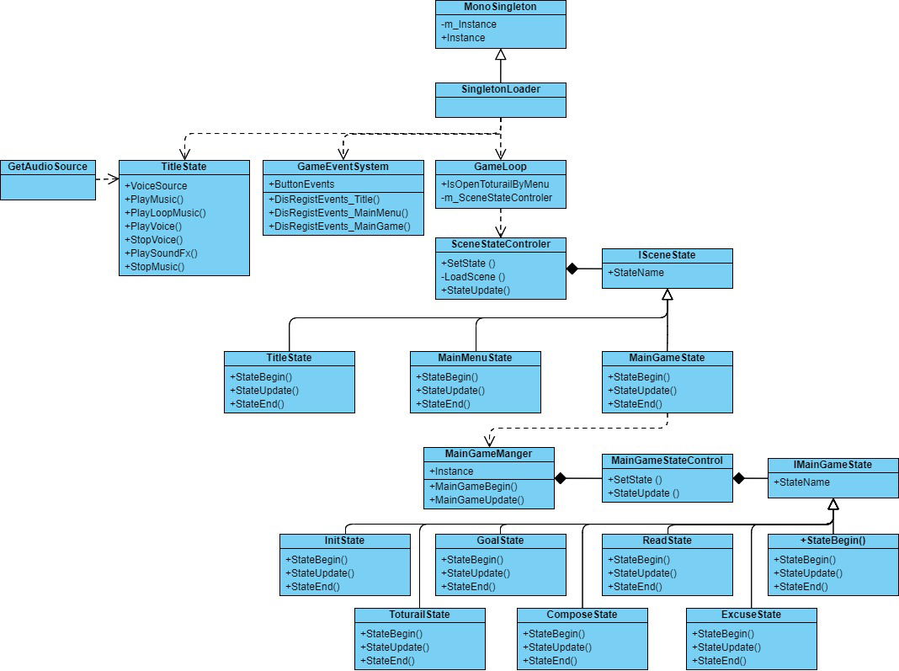
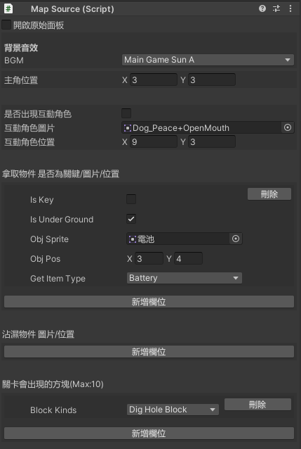

# **Project Name: Adventurer**

**`Unity version: 2019.4.3 or higher`**

Programmer: Chung-Hsuan Kuo

Planner: Suno Su

Artist: Awan Chan

Game Languages: Traditional Chinese, Simplified Chinese, English, Japanese


## Table of Contents
- [1. Preface](#1-preface)
- [2. Introduction](#2-introduction)
- [3. _Scenes Folder Description](#3-_scenes-folder-description)
- [4. _Script Folder Description](#4-_script-folder-description)
- [5. Main Structure](#5-main-structure)
- [6. BlockSystem](#6-blocksystem)
- [7. DatabaseDownloadTool](#7-databasedownloadtool)
- [8. MapTool](#8-maptool)
- [9. Table](#9-table)
- [10. Mibo](#10-mibo)


## **1. Preface**

This project was developed during my tenure as a game developer at NUWA Robotics (HK) LIMITED. The project took approximately two months to complete, encompassing planning, testing, and deployment. I was the principal programmer for this project. The primary platform for this game's release was the custom Android-based platform developed by Nuwa Robotics, and the game was published in the game store of Nuwa Robotics' Kebbi Air robot.

## **2. Introduction**

"Adventurer" is targeted at children aged 4-8. It integrates programmed learning with narrative plots, utilizing story tasks to familiarize children with basic physical expressions, orientation, spatial concepts, logic, and programming principles. It further nurtures children's empathy, emotional expression, and life education.

18 tasks introduce children to the fundamental programming concept of sequences and the skills of experimenting and iterating.

The game's basic rule requires the player to assemble program blocks to navigate the on-screen robot towards a specified goal.

The game is designed to start from the first level, with subsequent levels unlocking progressively. However, for project testing convenience, all levels have been unlocked initially, controlled by **`Assets/Resources/LevelPass.json`**.

The game's multilingual system is determined by the system language of the device it is outputted to, but I have currently enforced the game language to be in English to facilitate most users' experience. To revert to system language determination, one can adjust the settings accordingly.

To open the project using Unity, navigate to **`Assets/_Scenes/Game/TitleState`** and open the Scene. TitleState is the starting scene of the game, and the game operates smoothly when initiated from here.

## **3. _Scenes Folder Description**

**`Assets/_Scenes/Game`** contains the game's title, main menu, and main game scenes.

**`Assets/_Scenes/ForArtist`** contains scenes for artists to adjust animations, use the MapTool utility, and download Google Sheet data.

**`Assets/_Scenes/Test`** are scenes for testing.

## **4. _Script Folder Description**

`BlockSystem`: Programming logic and functionality for the game's block objects.

`DatabaseDownloadTool`: Downloads game data from Google Sheets using the Google App script API.

`LevelData`: Reads and saves game level completion data.

`MainGameState`: Uses the State Pattern to switch the main game state.

`Manager`: Various managers within the game.

`MapTool`: A UnityEditor tool developed for artists to design game maps.

`ResultSystem`: Determines and records game outcomes.

`SceneObject`: Logic for game characters and in-game objects.

`SceneState`: Uses the State Pattern to switch between different Unity scenes.

`Table`: Reads JSON files with different content.

`Test`: Programs for testing.

`UI`: Programs related to UI logic.

## **5. Main Structure**

The overarching structure of the game is as follows:



These projects are grounded in the core OOP principles of encapsulation, inheritance, and polymorphism, enhanced by the implementation of design patterns such as Singleton, State, and Observer.

### **5.1. MonoSingleton<T> and SingletonLoader**

The **`Assets/_Script/MonoSingleton`** and **`Assets/_Script/SingletonLoader`** scripts showcase a common implementation of the Singleton Pattern, ensuring a class has only one instance and providing a global access point.

`MonoSingleton<T>` is a generic base class for singletons, allowing various MonoBehaviour types to share the same singleton implementation pattern.

`SingletonLoader`, inheriting from **`MonoSingleton<SingletonLoader>`**, becomes a singleton itself, although it is not generic. It is a concrete implementation utilizing the singleton pattern of the generic **`MonoSingleton<T>`** class.

**Features of MonoSingleton<T> class:**

**`m_Instance`**: A private static variable to store the unique instance of the class.

**`m_IsDestroyed`**: A private static variable to track if the singleton has been destroyed.

**`IsNull()`**: A static method to check if the singleton is null.

**`Instance`**: A static property to get or create the instance of the class. If the instance doesn't exist, it first tries to find an existing instance, or if none, creates a new game object and attaches a component of this type.

**Features of SingletonLoader class:**

Inherits from **`MonoSingleton<SingletonLoader>`**, making it a singleton.

In the **`Awake()`** method, it first checks if any other **`SingletonLoader`** instances exist in the scene.

If there is only one instance, it marks itself to not be destroyed on loading new scenes (**`DontDestroyOnLoad(this.gameObject)`**).

If multiple instances exist, it immediately destroys the extra instances to ensure only one exists.

It also takes responsibility for adding a series of components to the game object, such as **`CurrLanguage, DatabaseManager, GameEventSystem, GameLoop, AudioManager, LoadAssetFile`**.

### **5.2. GameLoop**

The **`GameLoop`** class acts as the game's main loop or state manager, coordinating the overall running process of the game, including scene switching and state updates. Detailed explanation of the GameLoop class's purpose:

**Start**:

- In the **`GameLoop`** class, the **`Start`** method sets the initial scene state at game launch. Using the **`m_SceneStateControler.SetState`** method, the game is set to enter **`TitleState`** at launch.

**Update**:

- The **`GameLoop`** delegates the current scene state update to **`m_SceneStateControler`**. This means all the game logic updates are conducted through the current **`ISceneState`** instance, allowing each scene to have its own unique behavior and response.

### **5.3. SceneStateControler**

The **`SceneStateControler`** class is a scene state manager, responsible for controlling and managing the transitions and updates of game scene states. It employs the State Design Pattern, allowing the game to transition smoothly between different scenes such as **`TitleState`**, **`MainMenuState`**, **`MainGameState`**, etc. Here are the main components of the class:

**ISceneState m_SceneState**:

- A private member variable of interface type representing the current scene state. Any class that implements the **`ISceneState`** interface can act as a scene state.

**bool m_bRunBegin**:

- A boolean value to mark whether the **`StateBegin`** method of the current scene state has started running.

**AsyncOperation asyn**:

- An **`AsyncOperation`** object for asynchronous scene loading operations, allowing new scenes to be loaded without blocking the currently running scene.

**SetState method**:

- This public method is used to set a new scene state. It accepts an **`ISceneState`** object and a scene name string. If there is an old scene state, it first calls the old state's **`StateEnd`** method. Then, it loads the new scene (if a name is provided) and sets **`m_SceneState`** to the new state.

**LoadScene method**:

- A private method for asynchronously loading scenes based on the provided scene name. If the scene name is null or of zero length, it does nothing.

**StateUpdate method**:

- This public method should be called in the main game loop's **`Update`** method. It checks whether the scene has been loaded (if there's an asynchronous load operation). When the scene is loaded, if **`m_bRunBegin`** is **`false`**, it calls the **`StateBegin`** method of the current scene state and sets **`m_bRunBegin`** to **`true`**. In each **`Update`** call, it also calls the **`StateUpdate`** method of the current scene state.

The **`ISceneState`** interface contains three methods: **`StateBegin`** for initialization when entering a state, **`StateEnd`** for clean-up when leaving a state, and **`StateUpdate`** for the main logic in each **`Update`** cycle.

### **5.4. TitleState, MainMenuState, MainGameState**

The **`TitleState`**, **`MainMenuState`**, and **`MainGameState`** classes are concrete implementations of the **`ISceneState`** interface, used within Unity as part of the State Design Pattern, managed by **`SceneStateControler`** for the game's title screen, main menu, and main game states.

**StateBegin**:

- Called when a state begins, it overrides the **`StateBegin`** method of the **`ISceneState`** interface.

**StateUpdate**:

- Contains the logic that needs to be executed every frame during the title state.

**StateEnd**:

- Called when a state ends.

### **5.5. MainGameManager**

This script is a Unity MonoBehaviour class named **`MainGameManager`**. It manages different elements of the main game level, including UI components, game objects, and level states. It is designed to offer flexibility and reusability for different game levels and scenarios, and it utilizes encapsulation to control access to internal data within the class. It employs a singleton pattern, meaning there is only one instance of this class throughout the game, which can be accessed globally.

**MainGameBegin():**

- Called at the beginning of the game within **`MainGameState`**, it's used for loading assets and setting the initial state.

**MainGameUpdate():**

- Called within **`MainGameState`**, this method is invoked every frame to update the game state.

Here is a segment of **`MainGameManager`** utilizing encapsulation to control a parameter:

```csharp
csharpCopy code
GameObject controlBlockUICanvas;
    public GameObject ControlBlockUICanvases
    {
        get { return controlBlockUICanvas; }
        set { controlBlockUICanvas = value; }
    }

```

### **5.6. MainGameStateControl**

**`MainGameStateControl`** class in Unity C# is designed to manage the game states of the main game application. Below is an outline of its key features and how it encapsulates its functionality:

**GameFlowState Enumeration:**

- Defines a series of possible states the game can be in (**`Init`**, **`Tutorial`**, **`LevelGoal`**, **`ComposeBlock`**, **`ReadBlock`**, **`ExecuteBlock`**, **`CompleteBlock`**).

**GameState Property:**

- A public property that allows external read-only access to the current game state. This ensures that the state can only be modified internally, maintaining control over the game's flow.

**IMainGameState Interface:**

- A private field **`m_State`** holds an instance of the current state. The interface **`IMainGameState`** defines public methods (**`StateBegin`**, **`StateUpdate`**, **`StateEnd`**) that all state classes must implement.

**SetState Method:**

- It takes a **`GameFlowState`** value and a **`MainGameStateControl`** instance to set a new state. It first ends the current state (if any), then initializes the appropriate state based on the provided **`GameFlowState`**. This method illustrates the use of the state pattern, where the class behavior changes at runtime based on its state.

**StateUpdate Method:**

- It checks if **`m_State`** has been initialized and if **`m_bRunBegin`** is false, indicating the start of a new state, it calls **`StateBegin()`** on the current state and sets **`m_bRunBegin`** to true. After the initial call to **`StateBegin`**, it continually calls **`StateUpdate()`** on the current state, allowing the game to perform operations specific to that state.

Overall, **`MainGameStateControl`** encapsulates the game state logic by tracking the current state and delegating state-specific behavior to various state objects. This encapsulation separates state management issues from the rest of the game's logic, making the code more modular and easier to maintain.

### **5.7. InitState, TutorialState, GoalState, ComposeState, ReadState, ExcuseState, CompleteState**

These classes implement a state class of the **`IMainGameState`** interface. In the state management model, **`InitState, TutorialState, GoalState, ComposeState, ReadState, ExcuseState, CompleteState`** respectively represent the game's initial state, tutorial state, game goal explanation state, block assembly state, block reading state, block execution state, and completion state.

The **`Controller`** parameter is actually the **`m_SceneStateController`** in **`GameLoop`**, which manages the flow of all states in the game.

**StateBegin Method:**

- At the start of a state, the **`StateBegin`** method is called. This method is responsible for initializing the state.

**StateUpdate Method:**

- Called with each frame update, the **`StateUpdate`** method is used to transition from the current state to the next state.

**StateEnd Method:**

- Called when a state ends.

The **`InitState, TutorialState, GoalState, ComposeState, ReadState, ExcuseState, CompleteState`** classes are responsible for defining the behavior at the start of a state, the update logic, and the cleanup work at the end of a state, while the **`MainGameStateControl`** class, as the state machine, is responsible for managing the actual changes of these states.

### **5.8. GameEventSystem**

**`GameEventSystem`** class in Unity implements the Observer Pattern.

In the **`GameEventSystem`** class, there are multiple public fields of type **`UnityAction`** and **`UnityAction<int>`**, representing different events, such as button press events. When an event occurs (for example, when a user presses the "Start Game" button), the associated methods are called via **`UnityAction`**, notifying the observers that the event has taken place.

**For example:**

- **Title page events:** such as **`OnPushStartGameBtn`**, triggered when a player presses the "Start Game" button.
- **Main menu events:** such as **`OnPushSceneBtn`**, triggered when a player selects a scene.
- **Main game events:** such as **`OnPushRestartBtn`**, triggered when a player wishes to restart the current level.

When you want to remove all observers or when observers no longer need to receive notifications, you can use **`DisRegistEvents_...`** methods to set all event subscribers to **`null`**, which is the deregistration process in the observer pattern.

**`GameEventSystem`** as an implementation of the singleton pattern, ensures there is only one globally accessible event system instance in the game, allowing events to be triggered and listened to anywhere in the game. This is highly suitable for event management in game development.

### **5.9. AudioManager**

**`AudioManager`** class is used to play music and sound effects in Unity games. This class ensures that there is only one globally accessible audio manager instance.

Below is the explanation of this class:

- **`private AudioSource mAudioSource;`**: A private variable for playing music.
- **`private AudioSource mVoiceSource;`**: A private variable for playing sound effects.
- **`public AudioSource VoiceSource`**: A public read-only property to get the sound effect source **`mVoiceSource`**.
- **`PlayMusic(AudioClip music)`**: Takes an **`AudioClip`** object as a parameter to play music once. If music is already playing, it will stop the current music first.
- **`PlayLoopMusic(AudioClip music)`**: Takes an **`AudioClip`** object as a parameter to loop music. If music is already playing, it will stop the current music first.
- **`PlayVoice(AudioClip voice)`**: Plays a voice clip non-repetitively. If the voice is playing, it will stop the current voice first.
- **`StopVoice()`**: Stops playing sound effects.
- **`PlaySoundFx(AudioClip fx)`**: Uses the **`PlayOneShot`** method to play a sound effect. This method can play multiple sound effects simultaneously without stopping the currently playing sound effects.
- **`StopMusic()`**: Stops playing music.

Through this class, audio playback, including music and sound effects, can be managed within the game. It simplifies the complexity of audio playback by encapsulating the **`AudioSource`** component and related playback logic. Using a singleton pattern ensures there is only one global **`AudioManager`** instance, allowing convenient access and control of audio anywhere in the game.

### **5.10. GetAudioSource**

The **`GetAudioSource`** class in Unity projects acts as a centralized storage and playback controller for audio resources. It utilizes instances of **`AudioManager`** to play various kinds of audio, including background music and sound effects, and is placed on the same object in the Unity scene as **`SingletonLoader`**.

Multiple **`AudioClip`** variables marked with the **`[SerializeField]`** attribute are used to reference audio files in the Unity editor. These variables include various background music (such as main menu, sunny, rainy, and boss music) and sound effects (like start, leave, return, and button effects).

Methods such as **`PlayStartSound`**, **`PlayExitSound`**, etc., are used to play specified sound effects. These methods implement sound effect playback by calling the **`PlayVoice`** method of the **`AudioManager`** instance.

The design of the **`GetAudioSource`** class is to easily trigger audio playback in code without direct interaction with the **`AudioManager`** class. It encapsulates the playback logic by providing methods to play specific sound effects and music and ensures the organization and management of audio resources. This encapsulation allows other classes to simply play audio by calling the public methods of the **`GetAudioSource`** class.

## **6. BlockSystem**

The scripts within **`Assets/_Script/BlockSystem`** define the gameplay involving block combinations.

### **6.1. Block**

The **`Block`** class, inheriting from **`MonoBehaviour`**, implements the **`IBeginDragHandler`**, **`IDragHandler`**, **`IEndDragHandler`**, **`IPointerDownHandler`**, and **`IPointerUpHandler`** interfaces, indicating that objects of this class can respond to drag and pointer-related events.

The internal **`Connection`** class within **`Block`** represents the connection relationships between blocks, including the owner block, connection type, relative position, connected block, and acceptable block types. **`Connection`** also provides methods to manage connected blocks, such as detection and attachment, and disconnection.

Additionally, the **`Block`** class defines a **`BlockType`** enumeration to identify the type of blocks and a series of **`AudioClip`** variables to play various sound effects, which will be played through an instance of the **`AudioManager`** class.

The **`Block`** class also defines methods to handle drag events and the logic of block connections:

- **`CreateConnections`** is an abstract method that must be implemented in derived classes to create connection points for blocks.
- **`Detach`** method is used to disconnect blocks.
- **`ApplyDelta`** method moves the block and its child blocks.
- **`OnDrawGizmos`** method is used to draw connection points in the Unity editor.

### **6.2. SimpleInstructionBlock**

The **`SimpleInstructionBlock`** class, inheriting from the **`Block`** class, is a specific type of block designed for creating and managing connections of simple instruction blocks. In this class, the **`CreateConnections`** method is overridden to define how the **`SimpleInstructionBlock`** connects with other blocks.

By overriding the **`CreateConnections`** method, the **`SimpleInstructionBlock`** class can define its specific connection logic. This allows different types of blocks to have various ways of connecting, enabling the creation of diverse block structures and behaviors in the game.

All blocks are implemented based on the **`SimpleInstructionBlock`**.

### **6.3. BlockFunction**

The **`BlockFunction`** class in Unity is a MonoBehaviour that acts as an intermediary layer, integrating actions of robots and map characters. This class does not directly perform actions but instead calls methods defined in the **`RoleControl`** class to implement various functions. Thus, the **`BlockFunction`** class can trigger complex behaviors through simple method calls, while the specific execution logic remains within the **`RoleControl`** class.

**`RoleControl roleControl;`**: A variable of type **`RoleControl`**, used to reference the character controller responsible for executing actual character actions.

### **6.4. ExecuteBlock**

The **`ExecuteBlock`** class in Unity is used to execute a sequence of actions related to game blocks. It calls specific character actions through the **`BlockFunction`** class and uses coroutines (**`StartCoroutine`**) to delay action execution, thereby creating a coherent sequence of actions.

This class's design allows the separation of the action execution logic from the actual implementation of actions. **`ExecuteBlock`** is in charge of controlling the order and timing of actions, while **`BlockFunction`** performs the specific actions.

IE_DelayExecuteBlock coroutine:

- This coroutine executes actions sequentially based on a list of block names and delay times. It uses **`Enum.Parse`** to parse strings into the **`BlockKind`** enumeration type and calls the corresponding action methods in **`BlockFunction`** based on the parsed results.
- After executing each action, it triggers the **`NowPlayBlockSequenceEvent`** event and waits for the specified delay time before proceeding to the next action.
- If the character's status is available, it also determines whether the level has been successfully completed. If so, it triggers the **`SuccessThisLevelEvent`** and terminates subsequent actions.

## **7. DatabaseDownloadTool**

**`Assets/_Script/DatabaseDownloadTool`** contains scripts that interact with the Google App Script API.

Since the product will be released in mainland China, where Google services are not available, the download function is only used by planners in Unity's edit mode.

### **7.1. GASDatabase**

The **`GASDatabase`** class is a component in Unity for communicating with Google App Script (GAS). This class is responsible for sending HTTP requests to Google Sheets to fetch or send data, which is then saved locally in JSON format. It uses Unity's **`UnityWebRequest`** and **`Coroutine`** to handle network requests asynchronously.

This script is executed in the **`Assets/_Scenes/DatabaseDownloadTool`** scene.

Below is the explanation of the **`GASDatabase`** class:

**Member variables**:

- **`public DownloadDatabaseRecord downloadDatabaseRecords;`**: A public variable to store downloaded database records.
- **`List<string> DataTxt;`** and **`List<string> FileNameTxt;`**: Lists used to store downloaded data and filenames, respectively.
- **`int row;`** and **`int col;`**: Variables to store the number of rows and columns in the table.

**OnGUI method**:

- Draws text boxes and buttons on Unity's GUI. When a button is clicked, it triggers the loading, saving, or application exit of data.

**SaveData method**:

- Saves the inputted string (data in JSON format) to a local file.

**String_ChineseConvert method**:

- Converts Unicode Chinese characters in JSON data into recognizable Chinese characters.

**LoadData method**:

- Loads data from Google Sheets based on provided parameters (application ID, table name, number of rows and columns, and field names).

**Upload coroutine**:

- Retrieves or updates data by sending an HTTP POST request to the specified Google App Script URL.

### **7.2. DownloadDatabaseRecord**

The **`DownloadDatabaseRecord`** class is a **`ScriptableObject`** in Unity. A **`ScriptableObject`** is a class for storing data in Unity, with instances that can be saved as asset files in the project. It is used to save configuration information for connecting to Google App Script (GAS) services to download data.

- **`public string appID;`**: Used to store the application ID, which is the ID of the Google App Script project.
- **`public List<DownloadDatabaseRow> downloadDatabaseRows;`**: A list containing information about each downloaded database record.
- **`public string sheetName;`**: The name of the Google Sheet.

## **8. MapTool**

The **`Assets/_Script/MapTool`** directory contains the MapTool tool provided for our artists to edit maps within the scene, created using the UnityEditor.



### **8.1. MapManager**

The **`MapManager`** class is a MonoBehaviour in Unity responsible for setting up and initializing map resources and their elements, such as background music (BGM), characters, interactive characters, collectible items, and wettable objects. This class works closely with the **`MapSource`** class, which holds data for scene elements, while the **`MapManager`** class uses this data to create and place game objects.

Here is an explanation of the **`MapManager`** class:

**Member variables**:

- **`MapSource m_mapSource`**: References the associated **`MapSource`** object containing various configuration details about the map.
- **`MapLayer m_mapLayer`**: References the **`MapLayer`** object, which may be used to manage different map layers, such as the character layer or object layer.
- **`GetAudioSource.BGMKinds m_bGMKinds`**: An enumeration variable that stores the types of background music.
- Other variables, such as **`RoleObject m_roleObject`** and **`InterRoleObject m_interRoleObject`**, are used to store instances of map elements.

### **8.2. MapSource**

The **`MapSource`** class is a MonoBehaviour in Unity, acting as a container for level data, storing various elements and configurations related to the level. It includes the main character, interactive characters, collectible items, wettable objects, and level objects.

Here is an explanation of the **`MapSource`** class:

**Background Music (BGM)**:

- **`public GetAudioSource.BGMKinds BGM;`** defines the type of background music used for the level, where **`GetAudioSource.BGMKinds`** is an enumeration specifying the available kinds of background music.

**Main Character (RoleObjects)**:

- **`public RoleObject RoleObjects;`** stores data regarding the main character's position, where **`RoleObject`** is a class containing location information.

**Interactive Characters (InterRoleObjects)**:

- **`public InterRoleObject InterRoleObjects;`** stores data on the appearance state, sprite images, and positions of interactive characters.

**Collectible Items (GetItemObjects)**:

- **`public GetItemObject[] GetItemObjects;`** is an array containing information about items in the scene that players can collect, such as whether they are key items, underground, object sprites, and positions.

**Wettable Objects (WetObjects)**:

- **`public WetObject[] WetObjects;`** is an array containing information about objects in the scene that can get wet, including object sprites and positions.

**Level Objects (LevelBlocks)**:

- **`public LevelBlock[] LevelBlocks;`** is an array containing the types of blocks that will appear in the level.

### **8.3. MapToolEditor**

The **`MapToolEditor`** class is a custom inspector panel for the Unity editor, inheriting from the **`Editor`** class. It customizes the inspection panel layout and behavior for the **`MapSource`** class.

## **9. Table**

The **`Assets/_Script/Table`** directory contains scripts for accessing JSON files within the Resources folder.

### **9.1. Database**

The **`Database<T>`** class is an abstract generic class that defines the foundational structure of a data management system in Unity, particularly for handling the logic of loading and constructing data from JSON data sources. With generics, this system can be easily adapted for different types of data models without writing a significant amount of redundant code for each data type. This class uses the **`LitJson`** library to handle JSON data.

**Member variables**:

- **`protected string DataNameFromResources`**: The resource name used to load data from the Resources folder.
- **`protected JsonData m_jsondata`**: Stores data parsed from the JSON file.
- **`protected List<T> m_database`**: A generic list for storing records of specific data types.

**Abstract methods**:

- **`public abstract T FetchFromID(int id);`**: An abstract method to retrieve a data record by ID from the database.
- **`public abstract T FetchFromString_ID(string string_id);`**: An abstract method to retrieve a data record by string ID from the database.
- **`protected abstract void ConstructDatabase();`**: An abstract method for parsing JSON data and constructing the database in memory.
- **`public abstract void SetupDatabase();`**: An abstract method for setting up and initializing the database.

**SaveAndLoad member**:

- **`protected SaveAndLoad saveAndLoad`**: Likely used for data saving and loading logic, the specific implementation of the **`SaveAndLoad`** class is not provided in the code but may include methods for file read/write or data persistence management.

### **9.2. GameContentAudioDatabase, GameContentImageDatabase, GameContentTextDatabase, GameContentTTSDatabase, HandToHandTutorialTTSDatabase, LevelGoalTTSDatabase, LevelPassDatabase, ResultDecideDatabase, RobotmotionDatabase, TutorialTTSDatabase**

The above classes are specific implementations of **`Database<GameContentTextRow>`**, transforming JSON into a format that is convenient to invoke.

### **9.3. SaveAndLoad**

The **`SaveAndLoad`** class provides a series of methods for saving and loading data in JSON format. It uses the **`LitJson`** library to handle the serialization and deserialization of JSON data. This class can be widely used for data persistence in games, such as saving game settings and player progress.

**String_ChineseConvert method**:

- Converts Unicode-encoded Chinese characters in JSON strings into GBK encoding to display Chinese characters correctly.
- Uses regular expressions to match Unicode encoding and convert it to the corresponding character.

## **10. Mibo**

The **`Assets/Plugins/Mibo`** directory contains the API for Kebbi, a robot developed by NUWA ROBOTICS.

The **`Mibo`** class provides a set of static methods and events for controlling the Kebbi robot. These methods call native code via **`AndroidJavaClass`** on the Android platform, while in the Unity editor or other platforms, they only print corresponding debug information.

This class is a universal robot control interface that allows developers to respond when the robot's status changes through an event-driven model. Developers can program the robot for various functions, whether controlling motion, handling voice input/output, or managing LEDs and sensors.

On the Android platform, this class executes operations through the actual Android SDK called by **`AndroidJavaClass`**. In the Unity editor, all operations are converted to log output, facilitating developer debugging.
